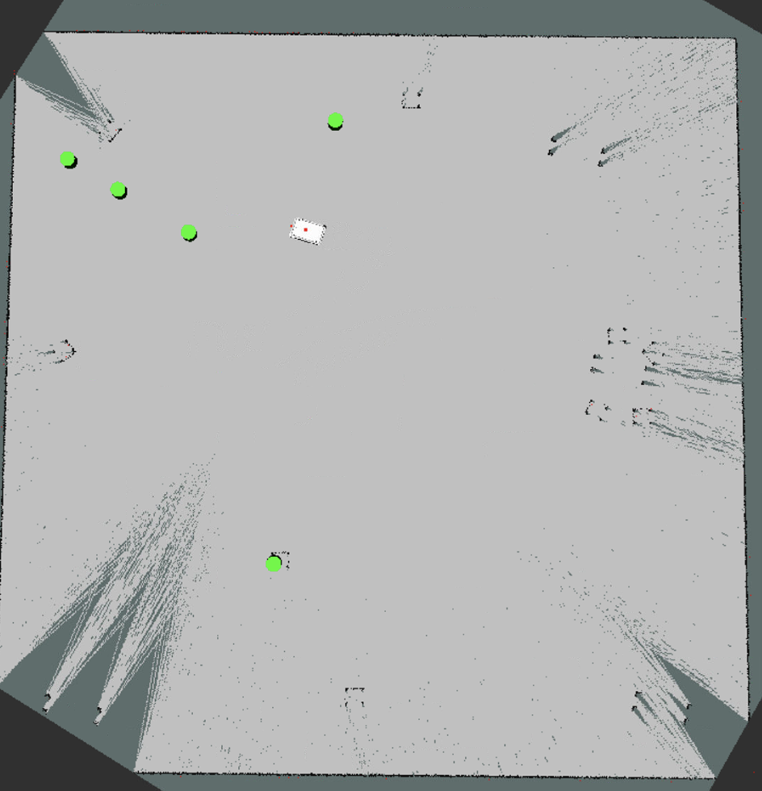
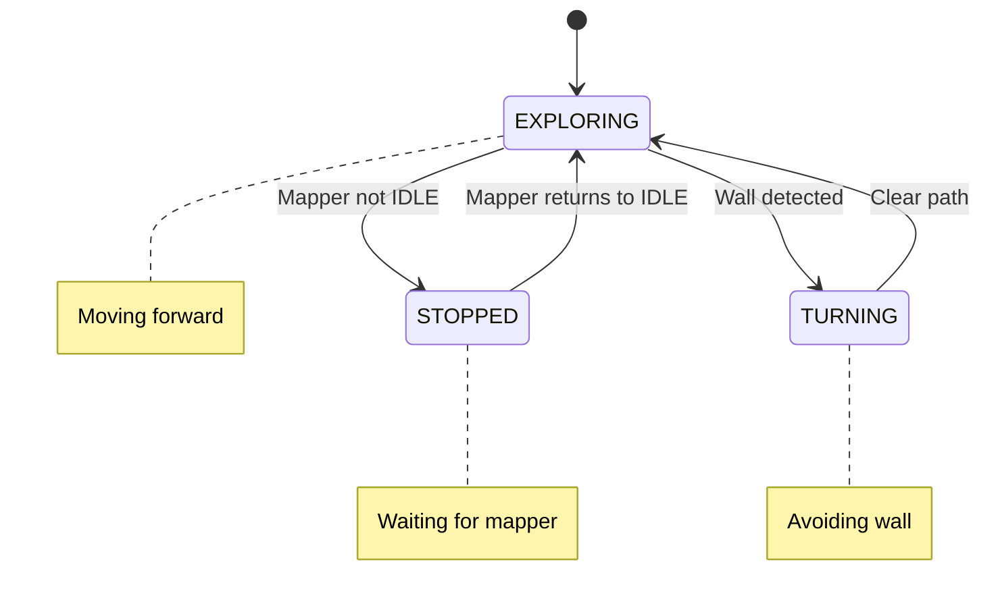
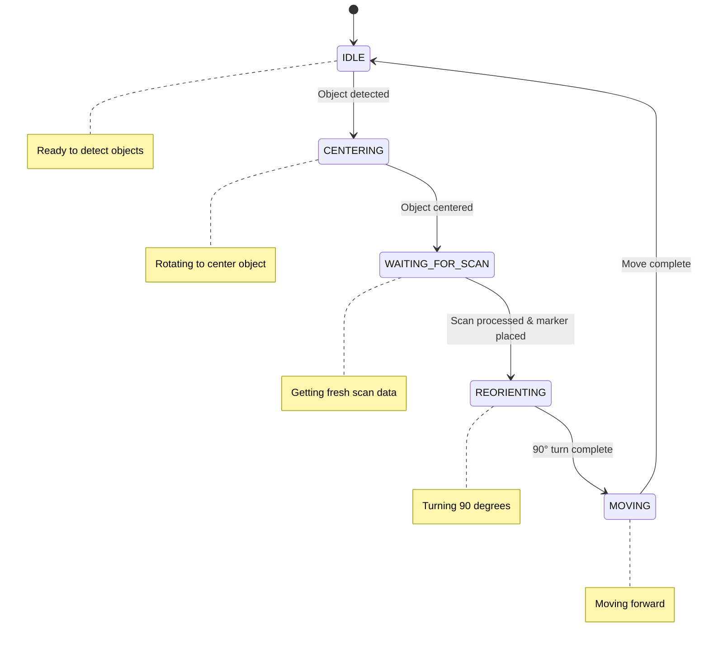

# AI3 ROAI Project

> Jan Langela Regincos, Manuel Kubu, Florian Lederer, Wolfgang Wilke
 
## Repository

https://github.com/Mani7K/ai3-roai-project/tree/master

## Task

Perception involves a deep understanding of the environment. Today, mobile robots can infer the
positions of objects from raw images. For example, when searching for a glass of water, the robot
looks on tables rather than the floor or chairs. In this project, you will implement a simplified
version of this process by creating a semantic map.

To start, download an arbitrary Gazebo world containing multiple rooms with chairs and tables.
Use the MiR100 robot to autonomously explore the environment and generate a semantic map
using data from a camera (which you will need to attach to the robot) and a laser scanner. To
create the semantic map, you can represent detected objects in RViz, using markers such as
boxes. Publish the positions of these detected objects as a ROS topic.

#### Image-Based Object Detection:

Implement an image-based detector (e.g., CNN or Vision Transformer) to identify chairs and
tables within camera frames. Use data from the laser scanner to estimate 3D coordinates of
detected objects, adding positional accuracy for displaying objects on the map.

#### Creating the Semantic Map:

Use ROS’s mapping capabilities to generate a 2D occupancy grid of the environment from laser
scan data, showing walls and room boundaries. Publish detected object positions and types (e.g.,
“Chair” or “Table”) on a ROS topic. Display the generated map in RViz, visualizing each detected
object as a marker within the mapped layout.

## Prerequisites

- Docker-ROS https://github.com/TW-Robotics/Docker-ROS/tree/master

## Setup

This project represents a ros package.\
When using the docker container described in prerequisites, clone/copy this repository into the `Docker-ROS/catkin_ws/src` directory.

Your folder structure should look like this:

```
Docker-ROS/
└── catkin_ws/
    └── src/
        └── ai3-roai-project
```

Inside the directory `Docker-ROS`, there is a file to run the docker container called `run_docker_from_hub.[sh|bat]`, which will also connect to a shell inside the container.

To install all required dependencies, which are currently not available inside the container, run this file:\
`/home/fhtw_user/catkin_ws/src/fhtw/ai3-roai-project/scripts/dependencies.sh`

After that, we can start the typical ros workflow:

1. Navigate to `/home/fhtw_user/catkin_ws/`
2. Run `catkin_make`
3. `source devel/setup.bash`
4. `roslaunch ai3-roai-project environment.launch`
   - This will start the environment
   - load gazebo world
     - Option A: gazebo_small_house\
       Complex map containing multiple rooms and additional furniture
     - Option B (default): simple\
       This is a small map with a few chairs, gazebo runs much smoother using this world\
       Ideal for demo purposes / testing
   - Spawns the robot, brings up controllers, etc.
5. `roslaunch ai3-roai-project object_mapping.launch`
   - This will start a node that explores and and a node that maps the world. The mapper subscribes to the `/object_detection` topic and will mark detected objects on the map.

You should now see a running gazebo instance, showing either the small_house or simple world including a mir100 with a camera (small red box) and a laser scanner (small red cylinder) mounted.

The image gets published to the topic `/image_raw`. It can be visualized e.g. by using rviz.
The laser scan data gets published to the topic `/scan`. It can be visualized using rviz as well.
When launching the SLAM node, a map is published to the topic `/map`, its visualized in the preconfigured rviz instance.



#### Object Detection

The object detection node publishes only if a chair or table is detected. The published message is an array of json object with the following structure:

```json
[
  {
    "class": "string",          // Detected object class
    "confidence": float,        // Confidence score (0.0 to 1.0)
    "bbox": [int, int, int, int] // Bounding box [x, y, width, height]
  }
]
```

It uses a yolov4-tiny model to predict object bounding boxes from an image.

### Explorer

For Mapping we use Hector SLAM, this gave us better results than gmapping (Probably as it doesn't rely on odemetry).
The Robot starts out Exploring the Terrain (Explorer Node). It Moves in a spiral, avoiding walls and obstacles on the way.
When the detection Node detects an object with a certain confidence, The Explorer node enters the `IDLE` state and allows the mapper to center the detected object. Once the mapper enters its `IDLE` state the Explorer continues.



### Mapper

The Mapper Node subscribes to the detector node and waits for an object to be detected. Once an object is detected the mapper enters the `CENTERING` state. In this state the robot will rotate so that the detected object lies in the center of the camera image. Once the object is centered the mapper waits for a fresh LIDAR scan and then calculates its distance to the object using the LIDAR data. Next a Marker is published and the Mapper enters the `REOEIENTATION` state, where it turns 90 degrees and drives a bit ignoring detected objects on the way. this is done to prevent the robot from getting fixated on the same object over and over again. Finally the Mapper enters its `IDLE` state allowing the Explorer to take over again.



### Known Issues

A list of issues and potential causes. Sadly we didnt have enough time to troubleshoot these yet.

- Sometimes nothing happens upon launching the environment and mapper. When this happens restart both launches. We did not have time to troubleshoot this yet.
- The maps corners are cut off, this may be due to a misconfiguration of hector slam.
- Object marker position diverge from their real position. This may be due to a lack of transformation conversion

The Detection/ Centering and Mapping work well, the main issue is the correct placement of markers
